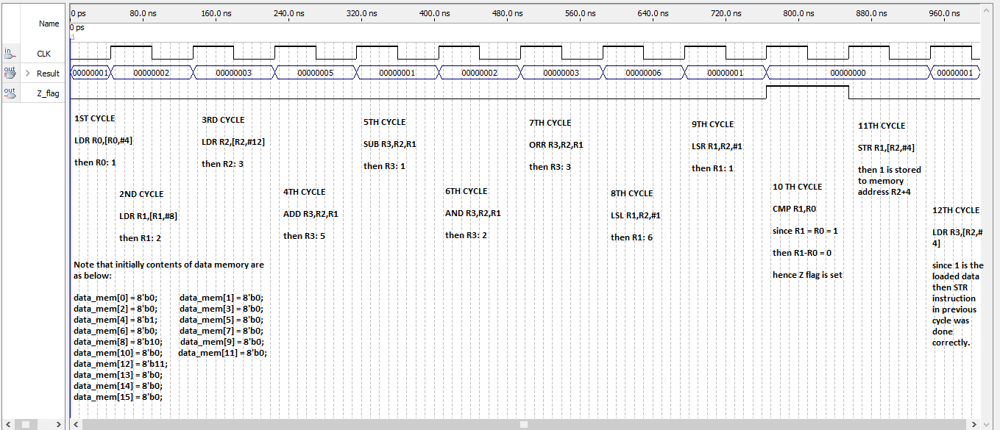

## About
For this project I designed the datapath and the controller unit of a 32-bit single cycle processor that supports some of the ARM instructions.
The instruction set of this processor is listed in the below table:
| mnemonic | name of the instruction         | instruction     | operation                      |
| :---:    | :---:                           | :---:           | :---:                          | 
| ADD      | Addition                        | ADD Rd,Rn,Rm    | Rd ← Rn+Rm                     |
| SUB      | Subtraction                     | SUB Rd,Rn,Rm    | Rd ← Rn-Rm                     |
| AND      | Logical and                     | AND Rd,Rn,Rm    | Rd ← Rn&Rm                     |
| ORR      | Logical or                      | ORR Rd,Rn,Rm    | Rd ← Rn|Rm                     |
| LSR      | Logical shift right immediate   | LSR Rd,Rn,imm   | Rd ← Rn>>imm                   |
| LSL      | Logical shift left immediate    | LSL Rd,Rn,imm   | Rd ← Rn<<imm                   |
| CMP      | Compare                         | CMP Rd,Rn       | set the zero flag if Rd-Rn = 0 |
| STR      | Store                           | STR Rd,[Rn,imm] | memory[Rn+imm] ← Rd            |
| LDR      | Load                            | LDR Rd,[Rn,imm] | Rd ← memory[Rn+imm]            |

Simulation results for each instruction in this processor's instruction set are as below:
 
    

    
